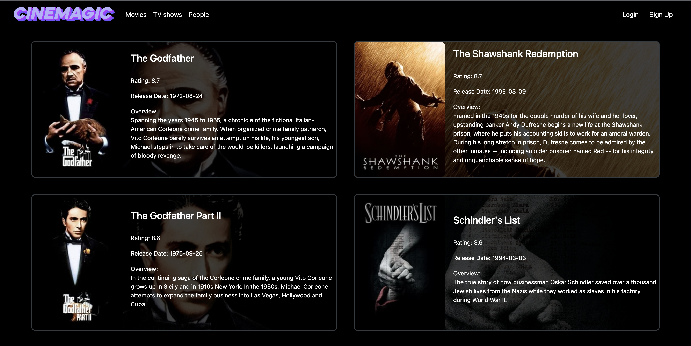
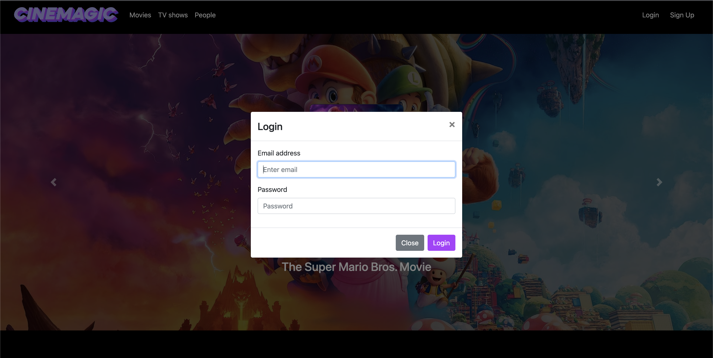
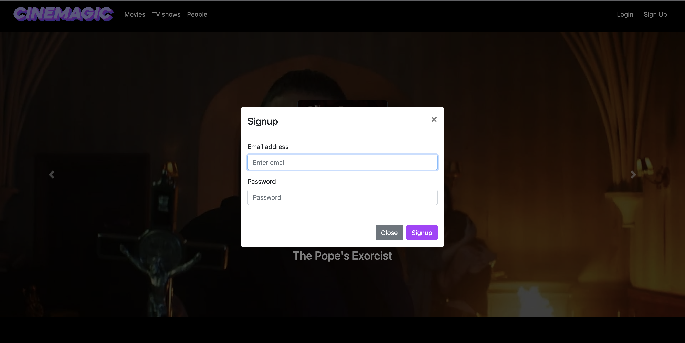

# Cinemagic

Cinemagic is a web application, where information about most popular, highest rated and upcoming movies, TV shows and people are shown.
Logged in users can also set different movies and TV shows as their favorites, so new recommendations can be generated based on them.
The goal for this project is to help people find information and recommend movies and TV shows.


## Dependencies

**Frontend:** Node.js

**Backend:** Maven3, Java 17

**Database:**  Currently H2, PostgreSQL in the future

**API:**  The Movie Database API: https://developers.themoviedb.org/3/getting-started/introduction
- to get an API key, you need to create an account on https://www.themoviedb.org/ 
- set it in your environment variables as TMDB_API_KEY

## Technologies

Spring Boot, Spring Security, Spring Data JPA, Spring

## Run Locally

Clone the project

```bash
  git clone https://github.com/CodecoolGlobal/el-proyecte-grande-sprint-2-java-vermout94
```

Go to the project directory

```bash
  cd el-proyecte-grande-sprint-2-java-vermout94
```


### Frontend

The other option is to run the frontend and backend separately.

Install dependencies

```bash
  cd front-end/cinemagic
  npm install
```

Start React on port 3000:

```bash
  npm start
```

### Backend

Run with Maven:

```bash
  cd back-end/cinemagic
  mvn spring-boot:run
```

It will start the server on port 8080.


## Screenshots








## Roadmap

- [x]  Setup project
- [x]  Add Spring Security
- [x]  Add frontend
- [ ]  Test backend (more blackbox, whitebox tests to come!)
- [ ]  Dockerize
- [ ]  Implement PostgreSQL

Stay tuned for more features in the future!

